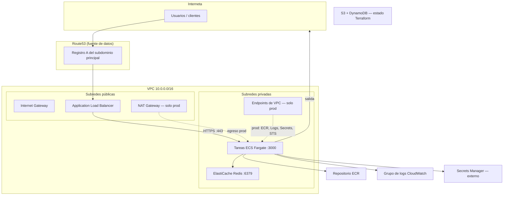
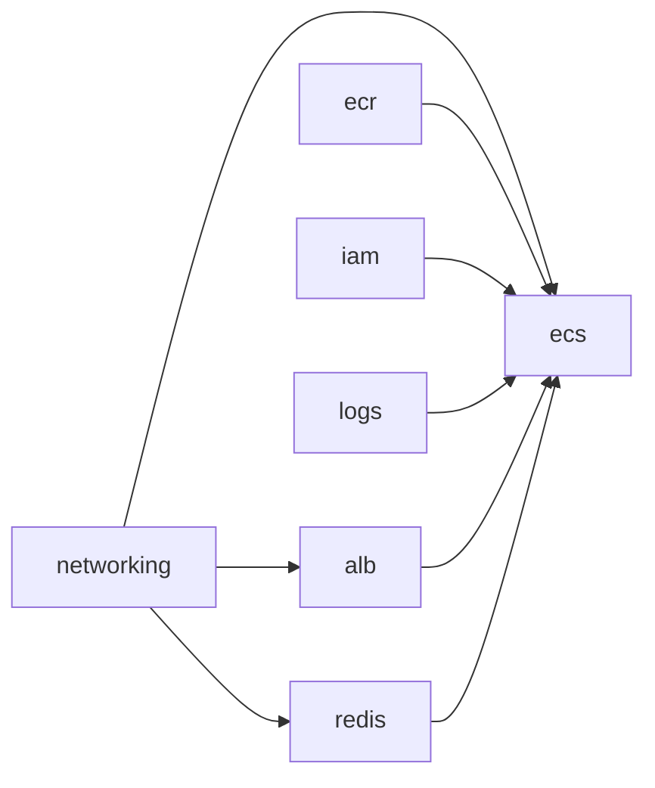

# Arquitectura AWS — Infraestructura Terraform (ebanking)

Documento de referencia de la infraestructura que este repositorio despliega en AWS.  
**Región por defecto:** `us-west-2` · **Estado de Terraform:** bucket S3 `ebanking-terraform-state`

---

## Resumen ejecutivo

El proyecto provisiona una **API containerizada** sobre **ECS Fargate**, expuesta por un **Application Load Balancer (ALB)** con terminación TLS. La caché usa **Amazon ElastiCache (Redis)**. Las imágenes viven en **ECR**; los logs en **CloudWatch**; la configuración sensible en **AWS Secrets Manager** (referenciado, no creado por Terraform).

La red es una **VPC dedicada** (`10.0.0.0/16`) con subredes públicas y privadas en dos zonas de disponibilidad. El comportamiento cambia según el **workspace de Terraform** (`prod` vs `development`).

| Métrica | Valor |
|--------|--------|
| Módulos Terraform | 7 |
| Cómputo | ECS Fargate |
| Entrada | ALB (HTTPS) |
| Caché | ElastiCache Redis |
| Puerto de la aplicación | 3000 |

---

## Diagrama general

---

## Flujo de una petición

1. El cliente resuelve `https://{subdominio}.{dominio_principal}` (registro **Route53** → alias del ALB).
2. El **ALB** termina TLS y reenvía tráfico HTTP al grupo de destino hacia las tareas ECS en el puerto **3000**.
3. La aplicación lee secretos desde **Secrets Manager** (rol IAM de la tarea) y se conecta a **Redis** en subredes privadas.
4. Las imágenes se obtienen de **ECR**; los logs se envían a **CloudWatch**.

**Comprobación de salud del ALB:** `GET /api/health` (código 200–399).

**Certificados:** ACM wildcard (dominio principal y secundario) — solo referenciados con `data`, no creados por este repo. El listener HTTPS adjunta el certificado secundario como certificado adicional.

**HTTP:** redirección 301 a HTTPS.

---

## Módulos Terraform

Orquestación en `main.tf`:

| Módulo | Recursos / responsabilidad |
|--------|----------------------------|
| **networking** | VPC, 2 subredes públicas + 2 privadas, IGW, NAT + EIP (condicional), tablas de ruteo, endpoints de interfaz VPC (condicional) |
| **alb** | ALB, grupo de destino, listeners HTTP/HTTPS, registro Route53 tipo A |
| **ecs** | Cluster ECS, definición de tarea Fargate, servicio, autoescalado por CPU y memoria (objetivo 90 %) |
| **redis** | Grupo de replicación ElastiCache en subredes privadas |
| **ecr** | Repositorio de imágenes + política de ciclo de vida |
| **iam** | Rol de ejecución de tarea + rol de tarea (lectura en Secrets Manager) |
| **logs** | Grupo de logs CloudWatch `/ecs/{proyecto}/{entorno}` |

### Dependencias entre módulos

---

## Topología de red (VPC)

| Recurso | CIDR / detalle |
|---------|----------------|
| VPC | `10.0.0.0/16` |
| Subred pública A | `10.0.0.0/24` (AZ `{region}a`) |
| Subred pública B | `10.0.1.0/24` (AZ `{region}b`) |
| Subred privada A | `10.0.10.0/24` |
| Subred privada B | `10.0.11.0/24` |

**Subredes públicas:** ALB, NAT (prod), asociadas a ruta `0.0.0.0/0` → Internet Gateway.

**Subredes privadas:** Redis siempre; tareas ECS en **prod**. En **development**, las tareas ECS usan subredes públicas con IP pública.

**Endpoints de interfaz VPC (solo prod):** ECR API, ECR DKR, CloudWatch Logs, Secrets Manager, STS — en subredes privadas, puerto 443.

---

## Grupos de seguridad

| Grupo | Entrada | Usado por |
|-------|---------|-----------|
| `alb-sg` | TCP 80 y 443 desde `0.0.0.0/0` | ALB |
| `svc-sg` | TCP 3000 solo desde el SG del ALB | Tareas ECS |
| `redis-sg` | TCP 6379 desde `10.0.0.0/16` | ElastiCache |
| `vpce-sg` (prod) | TCP 443 desde el CIDR de la VPC | Endpoints de VPC |

---

## Entornos: prod vs development

El entorno se deriva del **workspace de Terraform**:

- `terraform workspace select prod` → entorno **prod**
- Cualquier otro workspace → entorno **development**

| Configuración | **prod** | **development** |
|---------------|----------|-----------------|
| NAT Gateway | Sí | No |
| Endpoints de VPC | ECR, Logs, Secrets, STS | Ninguno |
| Subredes de tareas ECS | Privadas | Públicas + `assign_public_ip` |
| Rango de autoescalado | 1–4 tareas | 1–2 tareas |
| Retención de logs | 120 días | 30 días |
| IP de egreso estable | EIP del NAT (`output egress_ip`) | IP pública por tarea |
| Subdominio principal (por defecto) | `main` | `dev` |
| Subdominio secundario (por defecto) | `api` | `api-dev` |

---

## Recursos externos (no creados por este repo)

| Recurso | Cómo se usa |
|---------|-------------|
| Certificados **ACM** | `data.aws_acm_certificate` — wildcard en dominio principal y secundario |
| Zona **Route53** | Variable `primary_zone_id` |
| Secretos **Secrets Manager** | Prefijo `{proyecto}/{entorno}` o `secrets_path_prefix` |
| Backend **S3** | `ebanking-terraform-state`, clave `infra/terraform.tfstate` |
| Tabla **DynamoDB** | `terraform-locks` (bloqueo de estado) |

---

## Salidas útiles de Terraform

| Salida | Descripción |
|--------|-------------|
| `https_url_primary` | URL HTTPS del dominio principal |
| `https_url_secondary` | URL HTTPS del dominio secundario |
| `alb_dns` | Nombre DNS del balanceador |
| `egress_ip` | IP pública del NAT (prod) o `null` (dev) |
| `ecr_repo_url` | URL del repositorio ECR |
| `cluster_name` | Nombre del cluster ECS |
| `service_name` | Nombre del servicio ECS |

---

## Autoescalado ECS

- Dimensión: `ecs:service:DesiredCount`
- Mínimo / máximo: según entorno (ver tabla anterior)
- Políticas de seguimiento de objetivo: CPU promedio 90 %, memoria promedia 90 %
- Enfriamiento (scale in/out): 60 segundos

---

## Redis (ElastiCache)

- Un nodo (`num_cache_clusters = 1`)
- Tipo de nodo por defecto: `cache.t4g.micro`
- Cifrado en reposo: habilitado
- Cifrado en tránsito: deshabilitado
- URI expuesta a la tarea como variable de entorno `REDIS_URI`

---

## Etiquetado

Todos los recursos reciben etiquetas por defecto del proveedor AWS:

- `Project` = variable `project`
- `Env` = `prod` o `development`
- `Managed` = `terraform`

---

## Cómo usar este documento

- **Referencia técnica:** este archivo.
- **Presentación:** ver `docs/presentacion-arquitectura-aws.md` (formato Marp; exportable a PDF desde VS Code con la extensión Marp).

*Generado a partir del código en `infra/` y sus módulos.*
