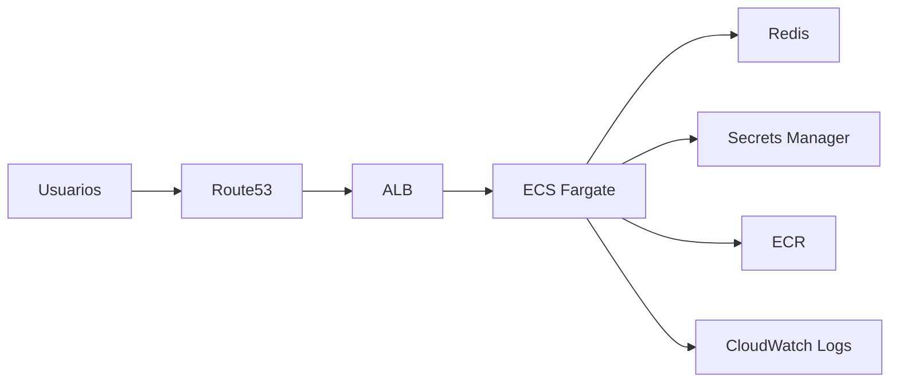

# Arquitectura AWS
## Infraestructura ebanking (Terraform)

Región: **us-west-2**  
Estado: S3 `ebanking-terraform-state`

---

## ¿Qué despliega este repo?

- API en **ECS Fargate** detrás de un **ALB**
- Caché **Redis** (ElastiCache)
- Imágenes en **ECR**
- Logs en **CloudWatch**
- Red **VPC** propia (pública + privada, 2 AZ)

**7 módulos Terraform** · Entorno por **workspace** (`prod` / `development`)

---

## Vista general

---

## Flujo de una petición

1. DNS → registro **A** en Route53 (zona principal)
2. **ALB** — TLS, redirect HTTP→HTTPS
3. Grupo de destino → tareas en puerto **3000**
4. App → **Redis**, secretos, APIs externas

Health check: `/api/health`

---

## Módulos Terraform

| Módulo | Función |
|--------|---------|
| networking | VPC, subredes, IGW, NAT, endpoints VPC |
| alb | Balanceador, HTTPS, Route53 |
| ecs | Cluster, servicio Fargate, autoescalado |
| redis | ElastiCache |
| ecr | Repositorio de contenedores |
| iam | Roles ECS + Secrets Manager |
| logs | Grupo de logs |

---

## VPC — subredes

| Tipo | CIDR (ejemplo) |
|------|----------------|
| Pública A | 10.0.0.0/24 |
| Pública B | 10.0.1.0/24 |
| Privada A | 10.0.10.0/24 |
| Privada B | 10.0.11.0/24 |

**VPC:** 10.0.0.0/16

---

## ¿Dónde corre cada cosa?

| Componente | Subred |
|------------|--------|
| ALB | Públicas |
| Redis | Privadas |
| ECS (prod) | Privadas |
| ECS (dev) | Públicas + IP pública |
| NAT (prod) | Pública A |

---

## Prod vs development

| | prod | development |
|---|------|-------------|
| NAT | Sí | No |
| VPC endpoints | Sí | No |
| ECS | Privado | Público |
| Escalado | 1–4 | 1–2 |
| Logs | 120 días | 30 días |

Workspace: `terraform workspace select prod`

---

## Seguridad de red (resumen)

- **ALB:** 80/443 desde Internet
- **ECS:** solo puerto 3000 desde el SG del ALB
- **Redis:** 6379 solo desde la VPC
- **Endpoints VPC (prod):** 443 desde la VPC

---

## Fuera de Terraform

- Certificados **ACM** (wildcard)
- Zona **Route53** (`primary_zone_id`)
- Secretos en **Secrets Manager**
- Bucket S3 + DynamoDB del **backend**

---

## Salidas importantes

- `https_url_primary` / `https_url_secondary`
- `alb_dns`
- `egress_ip` (IP fija de salida en prod)
- `ecr_repo_url`, `cluster_name`, `service_name`

---

## Documentación completa

Ver: `docs/arquitectura-aws.md`

*Diagramas Mermaid · código en `infra/modules/`*
